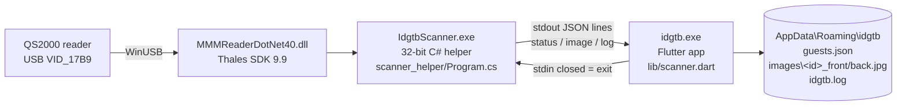
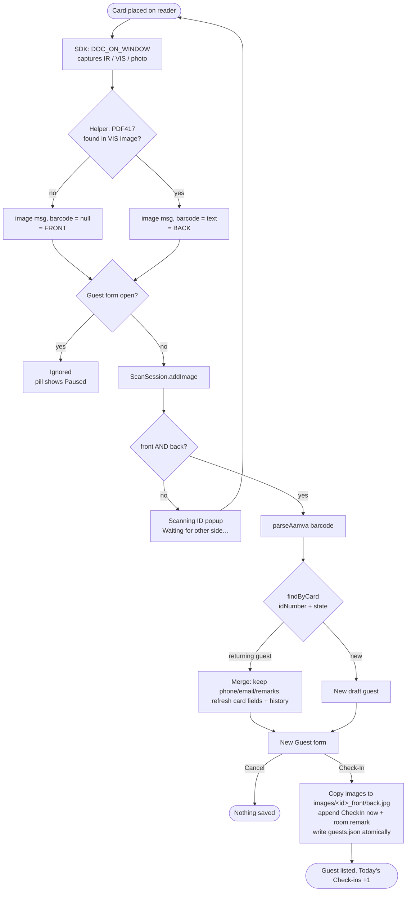
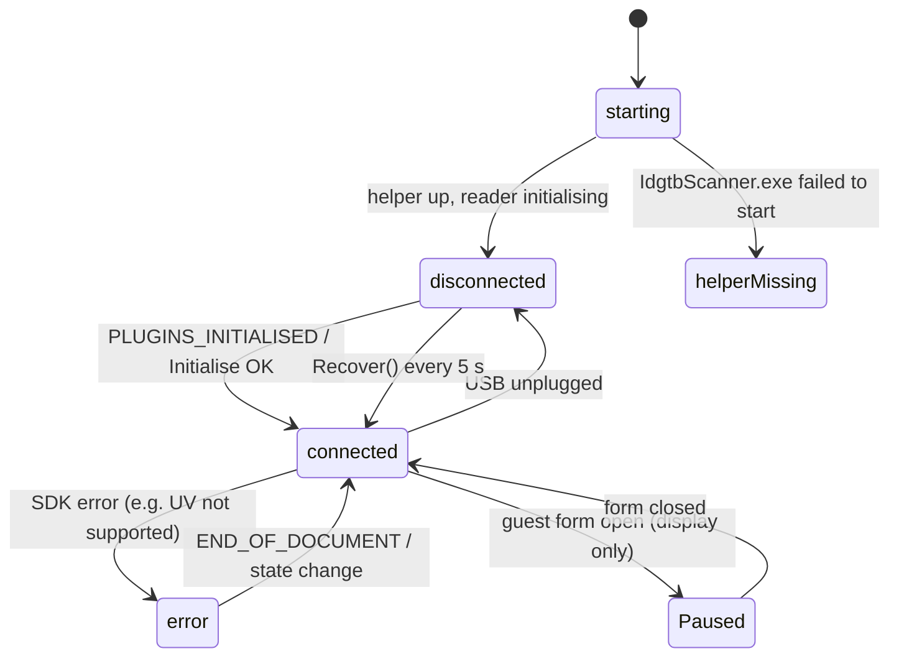

# idgtb

Front-desk guest check-in for Windows. You scan an ID card on a Thales/3M QS2000 reader, the guest form fills itself in, and you check the guest in.

## Architecture

The SDK is 32-bit .NET, so it runs in a separate helper process. The app starts the helper and reads one JSON message per line from it:

| `type` | Meaning | App reaction |
|---|---|---|
| `status` | `connected` / `disconnected` / `error` + message | Status pill bottom-right |
| `image` | Saved card side + PDF417 text (or null) | Feeds the scan session |
| `log` | Anything worth keeping | Appended to `idgtb.log` |

## Scan → check-in

Notes:
- The app tells the sides apart only by the barcode: the side with the PDF417 is the back. If a second side arrives with no barcode, the popup shows a red "retry back" hint.
- Scanning the same card again updates the existing guest (matched on `idNumber` + `state`) and adds a new check-in, so no duplicate guest is created.
- **View details** on a listed guest opens the same form with Save in place of Check-In. It edits fields and the last check-in remark.

## Scanner status pill

Click the pill to open **Scanner diagnostics**: it shows the current status, the last 400 log lines, **Copy log** and **Open log folder**.
